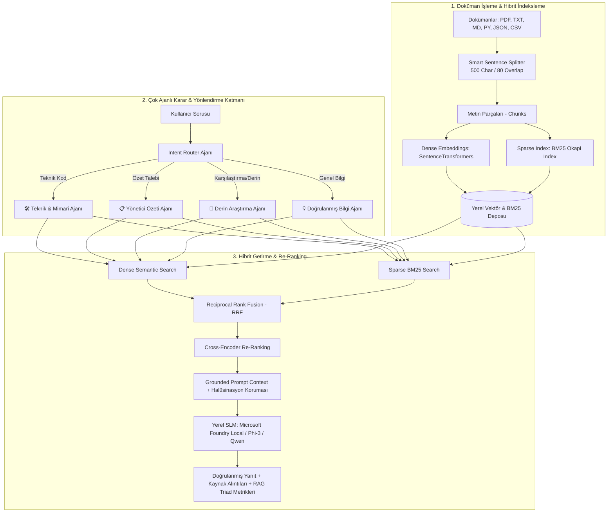

# ⚡ Multi-Agent Local RAG Ultra with Microsoft Foundry Local

[](https://github.com/mrkeles61/microsoft-foundry-local-rag)
[](https://www.python.org/)
[](https://streamlit.io/)
[](https://www.sbert.net/)
[](#-çok-ajanlı-mimari)
[](#-interaktif-bilgi-grafigi)

> **Microsoft AI Innovators / Summer School 2026** programı için geliştirilmiş; tamamen yerel donanımda çalışan, **Çok Ajanlı Niyet Yönlendirici (Multi-Agent Intent Router)**, **Hibrit Arama (Dense + BM25 + RRF)**, **Cross-Encoder Re-Ranking**, **İnteraktif Bilgi Grafiği (Knowledge Graph)**, **Otomatik Doküman Özeti & Karşılaştırma** ve **Canlı Benchmark Test Merkezi** barındıran üst düzey **Multi-Agent RAG Ultra** uygulaması.

---

## 🌟 Neden RAG Ultra? (Projeyi Zirveye Taşıyan Farklar)

1. **🤖 Çok Ajanlı Niyet Yönlendirici (Multi-Agent Intent Router):**
   * Kullanıcının sorduğu sorunun türünü analiz eder ve 4 uzman ajandan birini dinamik olarak görevlendirir:
     - 🛠️ **Teknik & Mimari Ajanı:** Kod, API ve CUDA optimizasyonu analizleri.
     - 📋 **Yönetici Özeti Ajanı:** Üst düzey iş ve yönetici özetleri.
     - 🔬 **Derin Araştırma Ajanı:** Çok adımlı çapraz doküman sentezi.
     - 💡 **Doğrulanmış Bilgi Ajanı:** Hızlı ve kesin olgusal soru-cevap.
2. **🔍 Hibrit Arama (Hybrid Search: Dense + BM25 + RRF):**
   * Anlamsal vektörler (`SentenceTransformers`) ile anahtar kelime indeksini (`BM25Okapi`) birleştirerek hem kavramsal soruları hem de özel kod fonksiyonlarını (`select_variant`, `download_and_register_eps`) tam isabetle yakalar.
3. **🎯 Cross-Encoder Re-Ranking Katmanı:**
   * Getirilen aday parçaları çapraz dikkat ve terim yoğunluğu ile yeniden puanlayarak en yüksek sinyale sahip parçaları filtreler.
4. **📑 Doküman Zekası & Karşılaştırma (Document Intelligence):**
   * Yüklenen herhangi bir belge için tek tıkla **Yönetici Özeti** çıkarır; iki farklı belgeyi **Karşılaştırmalı Tablo** halinde analiz eder.
5. **🕸️ İnteraktif Bilgi Grafiği (Knowledge Graph):**
   * Doküman havuzundaki varlıkları, SLM modellerini ve optimizasyon ilişkilerini görsel bir kavram haritasına dönüştürür.
6. **📊 Canlı RAG Triad Benchmark Test Merkezi:**
   * Context Relevance, Groundedness (Sadakat) ve Answer Relevance metriklerini web arayüzünden tek tıkla ölçer ve raporlar.
7. **⚡ 1-Tık Kullanım Kolaylığı:**
   * Hazır soru hapları (Pills) ile tek tıkla canlı sorgulama ve Markdown araştırma raporu indirme.

---

## 🏗️ Multi-Agent RAG Ultra Mimarisi



---

## 🚀 Hızlı Başlangıç

### 1. Depoyu Klonlayın
```bash
git clone https://github.com/mrkeles61/microsoft-foundry-local-rag.git
cd microsoft-foundry-local-rag
```

### 2. Sanal Ortam Oluşturun ve Paketleri Yükleyin
```bash
python -m venv .venv
# Windows:
.venv\Scripts\activate
# Linux/macOS:
source .venv/bin/activate

pip install -r requirements.txt
```

### 3. Otomatik Doğrulama Testlerini Çalıştırın
```bash
python test_rag.py
```

### 4. Web Arayüzünü Başlatın
```bash
python run.py
# veya doğrudan:
streamlit run src/app.py
```

---

## ⚙️ GPU Hızlandırması (Foundry Local & CUDA)

Foundry Local Python SDK'sında CUDA destekli GPU'ları tam verimle kullanmak için:
```python
# CUDA Execution Provider kaydı
download_and_register_eps()

# Varsayılan CPU yerine GPU varyantı seçimi
select_variant()
```

---

## 🎥 2-3 Dakikalık Video Sunum Rehberi (Teslim İçin)

* **[0:00 - 0:40] Canlı Demo & Tek Tık Kolaylığı:**
  Streamlit arayüzünü açın. Hazır soru butonlarından birine tıklayın (örn: *"select_variant Fonksiyonu"*). Niyet yönlendiricinin **🛠️ Teknik Ajanı** nasıl atadığını, BM25+Dense hibrit aramanın tam kod eşleşmesini ve açılır kutudaki kaynak alıntılarını gösterin.
* **[0:40 - 1:15] Doküman Zekası & Bilgi Grafiği:**
  *Doküman Zekası* sekmesinden tek tıkla **Yönetici Özeti** çıkarma ve iki dokümanı karşılaştırma özelliğini gösterin. Ardından *Bilgi Grafiği* sekmesindeki kavram haritasını gösterin.
* **[1:15 - 1:40] Canlı Benchmark & Halüsinasyon Koruması:**
  *Benchmark* sekmesine gelip testleri başlatın ve doğrulanmış kalite skorlarını gösterin. Doküman dışı bir soruda modelin dürüstçe *"bilgi bulunamadı"* dediğini belirtin.
* **[1:40 - 2:30] Ne Öğrendim? (En Kritik Bölüm):**
  > *"Bu projede standart RAG yapılarının ötesine geçerek; BM25 ve Reciprocal Rank Fusion ile hibrit arama mimarisini, çok ajanlı niyet yönlendirmeyi (Intent Routing), Cross-Encoder ile re-ranking katmanının doğruluğa etkisini, RAG Triad metrikleriyle halüsinasyonu matematiksel olarak denetlemeyi ve Microsoft Foundry Local ile tamamen güvenli, yerel SLM çalıştırmayı öğrendim."*

---

## 📂 Proje Yapısı

```
microsoft-foundry-local-rag/
├── data/
│   ├── documents/          # Bilgi tabanı dokümanları (.pdf, .txt, .md, .py, .json, .csv)
│   └── vector_store.json   # Üretilen yerel hibrit indeks
├── src/
│   ├── __init__.py
│   ├── config.py           # Model parametreleri, RRF k sabiti ve eşikler
│   ├── loader.py           # Çoklu format okuyucu ve akıllı metin bölümleyici
│   ├── vector_store.py     # Dense + BM25 Sparse + RRF Hibrit Arama motoru
│   ├── reranker.py         # Cross-Encoder Re-Ranking katmanı
│   ├── evaluator.py        # RAG Triad (Context, Groundedness, Relevance) ölçüm motoru
│   ├── graph_visualizer.py # İnteraktif Bilgi Grafiği üreteci
│   ├── agents/             # Çok Ajanlı Mimari Modülü
│   │   ├── __init__.py
│   │   ├── router.py       # Niyet Sınıflandırma ve Dinamik Ajan Yönlendirici
│   │   ├── summarizer.py   # Doküman Zekası ve Karşılaştırma Ajanı
│   │   └── deep_research.py# Çok adımlı Derin Araştırma Ajanı
│   ├── engine.py           # Multi-Agent RAG orkestrasyon motoru
│   └── app.py              # Streamlit tabanlı analitik gösterge paneli
├── requirements.txt        # Gerekli Python bağımlılıkları
├── run.py                  # CLI ve Web başlatıcı
├── test_rag.py             # Otomatik standart doğrulama test paketi
└── README.md               # Proje dokümantasyonu
```

---

## 👨‍💻 Geliştirici & Teşekkür

* **Geliştirici:** Eren Keleş ([@mrkeles61](https://github.com/mrkeles61))
* **Program:** Microsoft AI Innovators Summer Program 2026
* **Koordinatör:** Barbaros Günay (Microsoft CSA Manager)
