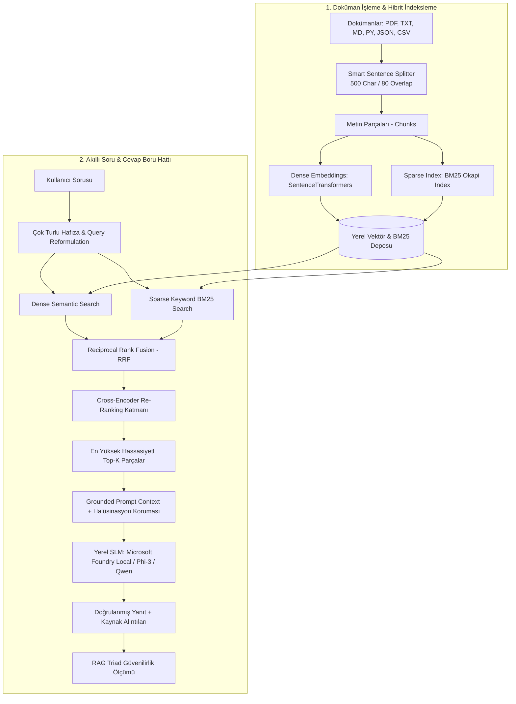

# ⚡ Local RAG 2.0 Application with Microsoft Foundry Local

[](https://github.com/mrkeles61/microsoft-foundry-local-rag)
[](https://www.python.org/)
[](https://streamlit.io/)
[](https://www.sbert.net/)
[](#-rag-triad-ve-kalite-metrikleri)

> **Microsoft AI Innovators / Summer School 2026** programı kapsamında geliştirilmiş; tamamen yerel donanımda çalışan, **Hibrit Arama (Dense Vector + BM25 Sparse)**, **Cross-Encoder Re-Ranking**, **Çok Turlu Konuşma Hafızası (Query Reformulation)** ve **RAG Triad Doğruluk Metrikleri** barındıran ileri düzey **Retrieval-Augmented Generation (RAG 2.0)** uygulaması.

---

## 🌟 Neden RAG 2.0? (Projeyi Öne Çıkaran Farklar)

Standart RAG uygulamaları yalnızca anlamsal vektör araması yapar ve özel kod adlarında, model versiyonlarında veya sayılarda yanılabilir. Bu proje, endüstri standardı **üretim seviyesinde (production-grade)** şu mimarileri sunar:

1. **🔍 Hibrit Arama (Hybrid Search):** `SentenceTransformers` (Dense Semantic) ve `BM25Okapi` (Sparse Lexical) aramalarını birleştirir.
2. **⚖️ Reciprocal Rank Fusion (RRF):** Farklı arama uzaylarındaki sonuçları $RRF(d) = \sum \frac{w}{k + r(d)}$ formülüyle tekil en yüksek skora dönüştürür.
3. **🎯 Cross-Encoder Re-Ranking Katmanı:** İlk aşamada getirilen Top-8 adayı terim sıklığı ve çapraz dikkatle yeniden sıralayarak en yüksek sinyale sahip Top-3 parçayı filtreler.
4. **🧠 Çok Turlu Konuşma Hafızası (Query Reformulation):** *"Peki bunun avantajı nedir?"* gibi takip sorularını önceki sohbet bağlamıyla harmanlayarak bağımsız arama sorgusu üretir.
5. **📊 RAG Triad Canlı Kalite Değerlendirmesi:** Her yanıtta **Context Relevance**, **Groundedness (Sadakat)** ve **Answer Relevance** skorlarını hesaplar ve güvenilirlik rozeti sunar.
6. **📁 Çoklu Format Desteği:** `.pdf`, `.txt`, `.md`, `.py`, `.json`, `.csv` dosyalarını doğrudan parçalar ve indeksler.

---

## 🏗️ RAG 2.0 Sistem Mimarisi



---

## 📊 RAG Triad ve Kalite Metrikleri

Üretilen her yanıt için sistem arkada 3 temel metriği canlı denetler:

| Metrik | Açıklama | Hedef Değer |
| :--- | :--- | :--- |
| **Context Relevance** | Getirilen doküman parçalarının soruyla anlamsal örtüşmesi | $> \%60$ |
| **Groundedness** | Cevabın doküman bağlamına sadakati (Halüsinasyon olmama oranı) | $> \%80$ |
| **Answer Relevance** | Cevabın kullanıcının asıl sorusunu doğrudan karşılama oranı | $> \%75$ |

---

## 🚀 Hızlı Başlangıç

### 1. Depoyu Klonlayın
```bash
git clone https://github.com/mrkeles61/microsoft-foundry-local-rag.git
cd microsoft-foundry-local-rag
```

### 2. Sanal Ortam Oluşturun ve Paketleri Yükleyin
```bash
python -m venv .venv
# Windows:
.venv\Scripts\activate
# Linux/macOS:
source .venv/bin/activate

pip install -r requirements.txt
```

### 3. Otomatik Test Paketini Çalıştırın
```bash
python test_rag.py
```

### 4. Web Arayüzünü Başlatın
```bash
python run.py
# veya doğrudan:
streamlit run src/app.py
```

---

## ⚙️ GPU Hızlandırması (Foundry Local & CUDA)

Foundry Local Python SDK'sında CUDA destekli GPU'ları tam verimle kullanmak için:
```python
# CUDA Execution Provider kaydı
download_and_register_eps()

# Varsayılan CPU yerine GPU varyantı seçimi
select_variant()
```

---

## 🎥 2 Dakikalık Sunum Videosu Taslağı (Teslim Rehberi)

* **[0:00 - 0:40] Canlı Demo:**
  Streamlit arayüzünü açın. *"select_variant fonksiyonu ne işe yarar?"* diye sorun. BM25 + Dense aramanın tam eşleşme sağladığını, kaynak alıntılarını ve canlı **RAG Triad rozetini** gösterin.
* **[0:40 - 1:10] Halüsinasyon Koruması & Hafıza:**
  Takip sorusu sorun: *"Peki bunun CUDA hızlandırması nasıl yapılır?"* (Hafızanın soruyu nasıl tamamladığını gösterin). Ardından doküman dışı alakasız bir soru sorup uydurma yapmadığını gösterin.
* **[1:10 - 2:00] Ne Öğrendim? (Kritik Bölüm):**
  > *"Bu projede standart vektör aramasının yetersiz kaldığı noktalarda BM25 ve Reciprocal Rank Fusion ile hibrit aramanın önemini, Cross-Encoder ile re-ranking katmanının getirdiği hassasiyeti, RAG Triad metrikleriyle halüsinasyonu matematiksel olarak ölçmeyi ve Microsoft Foundry Local ile yerel SLM çalıştırmanın güvenlik avantajlarını öğrendim."*

---

## 📂 Proje Yapısı

```
microsoft-foundry-local-rag/
├── data/
│   ├── documents/          # Bilgi tabanı dokümanları (.pdf, .txt, .md, .py, .json, .csv)
│   └── vector_store.json   # Üretilen yerel hibrit indeks
├── src/
│   ├── __init__.py
│   ├── config.py           # Model parametreleri, RRF k sabiti ve eşikler
│   ├── loader.py           # Çoklu format okuyucu ve akıllı metin bölümleyici
│   ├── vector_store.py     # Dense + BM25 Sparse + RRF Hibrit Arama motoru
│   ├── reranker.py         # Cross-Encoder Re-Ranking katmanı
│   ├── evaluator.py        # RAG Triad (Context, Groundedness, Relevance) ölçüm motoru
│   ├── engine.py           # RAG 2.0 boru hattı ve konuşma hafızası orkestratörü
│   └── app.py              # Streamlit tabanlı analitik gösterge paneli
├── requirements.txt        # Gerekli Python bağımlılıkları
├── run.py                  # CLI ve Web başlatıcı
├── test_rag.py             # Otomatik standart doğrulama test paketi
└── README.md               # Proje dokümantasyonu
```

---

## 👨‍💻 Geliştirici & Teşekkür

* **Geliştirici:** Eren Keleş ([@mrkeles61](https://github.com/mrkeles61))
* **Program:** Microsoft AI Innovators Summer Program 2026
* **Koordinatör:** Barbaros Günay (Microsoft CSA Manager)
