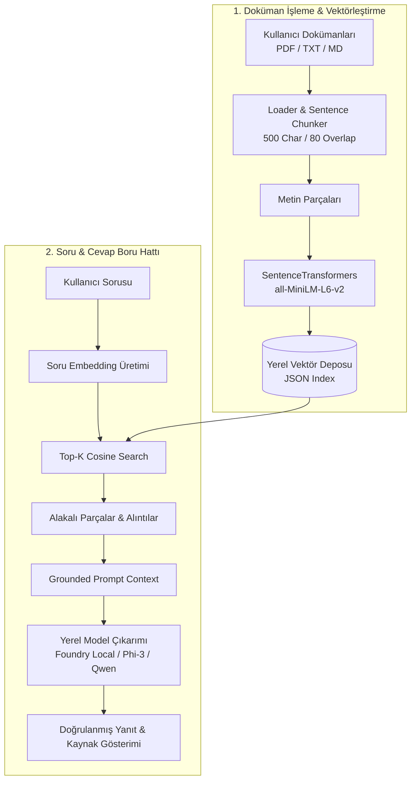

# 🤖 Local RAG Application with Microsoft Foundry Local

[](https://github.com/mrkeles61/microsoft-foundry-local-rag)
[](https://www.python.org/)
[](https://streamlit.io/)
[](https://www.sbert.net/)

> **Microsoft AI Innovators / Summer School 2026** programı kapsamında geliştirilmiş; tamamen yerel donanımda çalışan, veri gizliliğini koruyan ve doğrulanabilir kaynak gösterimi sunan **Retrieval-Augmented Generation (RAG)** uygulaması.

---

## 📌 Proje Özeti ve Amacı

Geleneksel bulut tabanlı yapay zeka çözümleri veri gizliliği riskleri, ağ gecikmesi ve yüksek API maliyetleri barındırır. Bu proje, **Microsoft Foundry Local** ve yerel küçük dil modelleri (SLM - Phi-3, Qwen, Llama) altyapısını kullanarak:
1. Kullanıcının özel dokümanlarını (PDF, TXT, Markdown) yerel ortamda indeksler.
2. Vektör benzerlik araması (Cosine Similarity) ile en alakalı bağlamı tespit eder.
3. Halüsinasyonu engelleyen özel yönlendirme ile yalnızca doküman içeriğine dayalı, kaynak referanslı yanıtlar üretir.

---

## 🏗️ Mimari ve Çalışma Prensibi



---

## ✨ Temel Özellikler

* 🔒 **Sıfır Veri Sızıntısı (Zero Data Leakage):** Tüm dokümanlar ve çıkarımlar yerel cihazınızda kalır; harici sunucuya veri gitmez.
* 🛡️ **Anti-Halüsinasyon Koruması:** Model, verilen belgelerde cevabı bulunmayan sorular için uydurma yapmaz ve kullanıcıyı dürüstçe uyarır.
* 📑 **Çoklu Format Desteği:** PDF, TXT ve Markdown formatlarındaki belgeleri anında okur ve parçalar (chunking).
* 🎯 **Şeffaf Kaynak Alıntıları:** Üretilen her yanıtın altında yararlanılan belgenin adı, parça numarası ve benzerlik skoru gösterilir.
* 💻 **Esnek Model Uyumluluğu:** Microsoft Foundry Local, LM Studio, Ollama veya yerel OpenAI-uyumlu tüm uç noktalarla tak-çalıştır entegrasyon.
* 🎨 **Modern Streamlit Arayüzü:** Belge yükleme, indeks tazeleme, parametre yönetimi ve sohbet arayüzü tek ekranda.

---

## 🚀 Kurulum ve Çalıştırma

### 1. Depoyu Klonlayın
```bash
git clone https://github.com/mrkeles61/microsoft-foundry-local-rag.git
cd microsoft-foundry-local-rag
```

### 2. Sanal Ortam Oluşturun ve Bağımlılıkları Yükleyin
```bash
python -m venv .venv
# Windows için:
.venv\Scripts\activate
# Linux/macOS için:
source .venv/bin/activate

pip install -r requirements.txt
```

### 3. Uygulamayı Başlatın

#### Web Arayüzü (Önerilen):
```bash
python run.py
# veya doğrudan:
streamlit run src/app.py
```

#### Terminal / CLI Modu:
```bash
python run.py --cli
```

---

## ⚙️ GPU Hızlandırması (Foundry Local & CUDA)

Foundry Local Python SDK'sında CUDA destekli GPU'ları tam verimle kullanmak için:
```python
# CUDA Execution Provider kaydı
download_and_register_eps()

# Varsayılan CPU yerine GPU varyantı seçimi
select_variant()
```

---

## 📂 Proje Yapısı

```
microsoft-foundry-local-rag/
├── data/
│   ├── documents/          # İndekslenecek örnek bilgi tabanı ve belgeler
│   │   ├── microsoft_foundry_local_overview.md
│   │   └── retrieval_augmented_generation_guide.txt
│   └── vector_store.json   # Üretilen yerel vektör indeksi
├── src/
│   ├── __init__.py
│   ├── config.py           # Model isimleri, chunk size, threshold ve URL ayarları
│   ├── loader.py           # PDF, TXT, MD okuyucu ve akıllı metin bölümleyici
│   ├── vector_store.py     # SentenceTransformer embedding + Cosine benzerlik motoru
│   ├── engine.py           # RAG retrieval, context injection ve SLM çıkarımı
│   └── app.py              # Streamlit tabanlı modern web arayüzü
├── requirements.txt        # Gerekli Python paketleri
├── run.py                  # CLI ve Web başlatıcı
└── README.md               # Proje dokümantasyonu
```

---

## 🎥 Sunum Videosu & Öğrenilenler (2-3 Dakika)

Videoda bahsedilmesi gereken ana başlıklar:
1. **Ne Yaptım?**
   - Yerel dokümanları okuyan, parçalayan, vektörleştiren ve yerel model üzerinden kaynak göstererek yanıtlayan bir RAG mimarisi geliştirdim.
   - Streamlit ile kullanıcı dostu bir arayüz hazırladım.
2. **Ne Öğrendim?**
   - RAG boru hattında chunk boyutu ve örtüşme (overlap) oranının geri getirme (retrieval) başarısına doğrudan etkisini.
   - Vektör veritabanlarında kosinüs benzerliği ile anlamsal eşleşmenin nasıl çalıştığını.
   - Yerel SLM'lerin (Phi-3 gibi) buluta ihtiyaç duymadan düşük gecikme ve sıfır veri sızıntısıyla çalıştırılabilme avantajını.
   - Halüsinasyonu engellemek için prompt mühendisliği ve sistem talimatı kısıtlamalarını.

---

## 👨‍💻 Geliştirici & Teşekkür

* **Geliştirici:** Eren Keleş ([@mrkeles61](https://github.com/mrkeles61))
* **Program:** Microsoft AI Innovators Summer Program 2026
* **Koordinatör:** Barbaros Günay (Microsoft CSA Manager)
